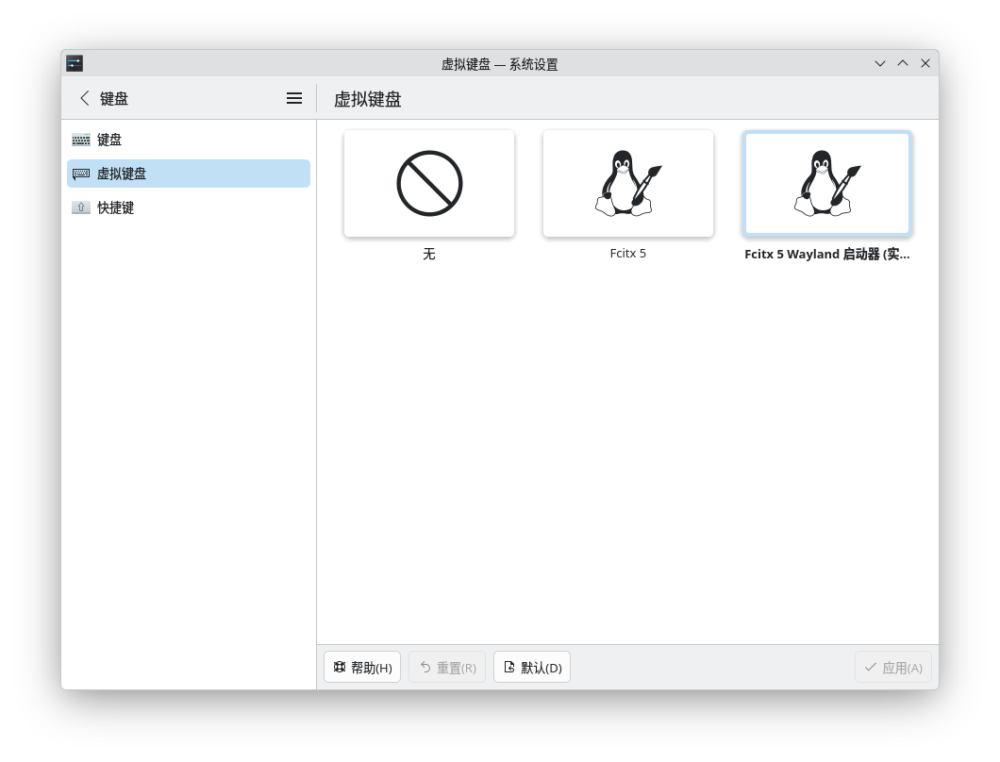

# Vanilla OS Kipferl 中国镜像

用于构建 Vanilla OS Kipferl 中国镜像的 Containerfile。

> [!CAUTION]
> Kipferl 镜像不由 Vanilla OS 官方维护。
>
> 该镜像目前仍处于开发状态，不建议在生产环境中使用。
>
> 在[#489](https://github.com/Vanilla-OS/vanilla-installer/pull/489)被官方合并之前，请勿将此镜像用作“初始镜像”。如要使用该镜像，请在安装官方（或本地化）镜像后使用`abroot rebase`进行变基。

这些镜像基于以下镜像并行构建：

- [vanilla-kde/kde](https://github.com/Vanilla-KDE/desktop-image/pkgs/container/kde) -> kde-china
- [vanilla-kde/kde-vm](https://github.com/Vanilla-KDE/desktop-image/pkgs/container/kde-vm) -> kde-vm-china

## 所应用的更改

- 预置 GHCR、Docker Hub 与 Flathub 的国内镜像
- 预置 fcitx5-chinese-addons 与 fcits5-rime 输入法选项
- 默认使用本地化的 vso-china-image

## 安装方法

首先，您可以从 [Vanilla OS 官网](https://vanillaos.org/)或[清华大学开源软件镜像站](https://mirrors.tuna.tsinghua.edu.cn/github-release/Vanilla-OS/live-iso)获取 Vanilla OS 的安装镜像。之后，您需要将安装镜像烧录到 U 盘中，并进入 BIOS/UEFI 设置调整启动顺序，从 U 盘启动计算机。

要在 Vanilla OS 中使用本地化镜像，请在安装系统时选择“Install Custom Image (Advanced)”选项。之后，按照顺序设置您的语言（以中国大陆为例，选择 Chinese (Simplified)）、时区 (以中国大陆为例，选择 Shanghai)。随后，当提示输入镜像名称时，请输入以下镜像之一（以使用南京大学开源镜像站为例，也可以使用其他 GHCR 镜像）：

> [!CAUTION]
> 在[#489](https://github.com/Vanilla-OS/vanilla-installer/pull/489)被官方合并之前，请勿将此镜像输入用作“初始镜像”。请先按照[china-image](https://github.com/Vanilla-Flavors/china-image)提供的安装指南安装完成之后，使用`abroot rebase <镜像名>`进行变基。

- ghcr.nju.edu.cn/vanilla-kde/kde-china:dev *(适合多数桌面用户)*
- ghcr.nju.edu.cn/vanilla-kde/kde-vm-china:dev *(适用于虚拟机)*
- 
如果您的 Vanilla OS 已经安装完成，请使用 `abroot rebase <镜像名>` 来应用本地化镜像。

### 输入法

安装完毕开机，设置好您的用户，在欢迎中心中选择您所需要的应用程序并安装。在此处，您可以选择您需要的输入法。等待欢迎中心配置完成后，请打开 KDE 设置，找到键盘 => 虚拟键盘。

选择 Fcitx 5。

之后，请搜索并打开 Fcitx 配置，选择右侧的词库/输入方式，并点击左箭头来添加到输入法列表中。

该镜像预装了两种输入法：

- 中文插件（fcitx5-chinese-addons）：开箱即用，无须额外配置
- 中州韵（fcitx5-rime）：智能输入引擎，可以自由安装输入方案

您可以按照自己的需求自行选择。如果您选择中州韵输入法，您可以在输入框中按下 Ctrl+` or F4 来切换输入方案、简繁体等。预装的朙月拼音在大多数情况下已经足够使用，您还可以安装其他输入方案，如雾凇拼音等。

声明：该镜像并非由 Vanilla OS 官方进行维护。
